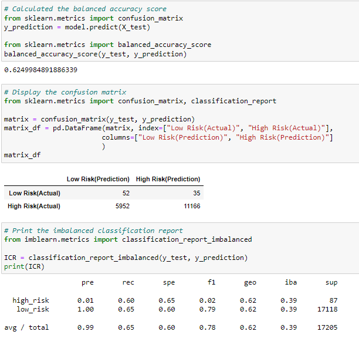
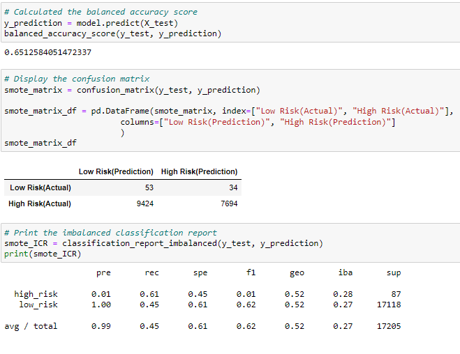
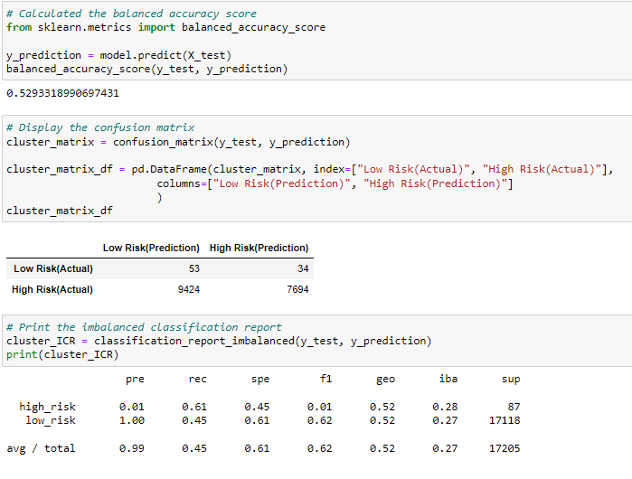
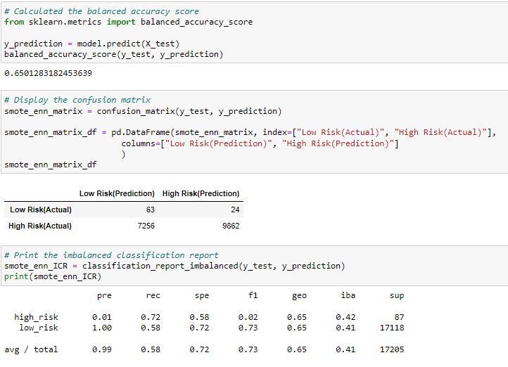
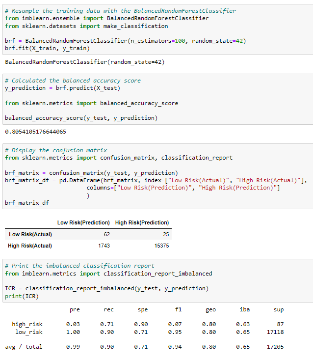
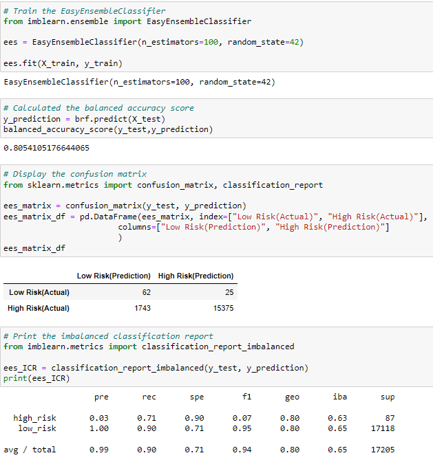
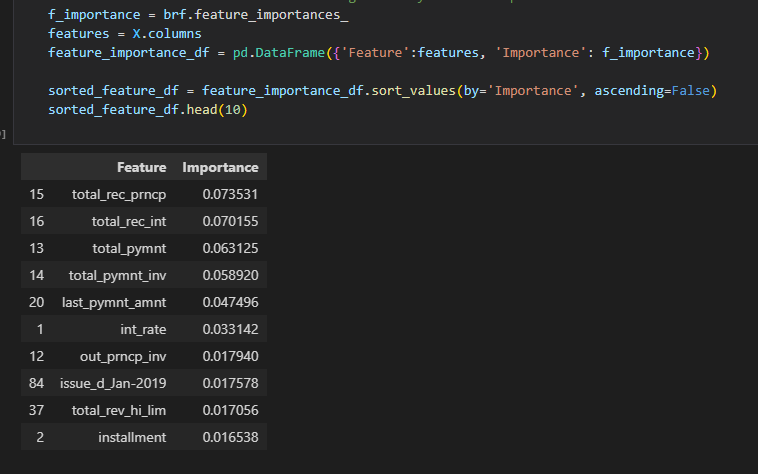

# Credit_Risk_Analysis Overview

In this analysis we are utilizing a given data set of credit card application to determine viability of the 
applicant. Running sampling to test the data to find low and high risk applicants. In our analysis we are pulling
from different oversampling techniques to find the best model to determine accuracy.

# Credit_Risk_Analysis Results

## Oversampling

### Niave Random Sampling
- Accuracy Score: 62%
- Precision: Low Risk is accurately depicted whereas High Risk has an extremely low score.
- Recall: Low Risk: 65  High Risk: 60 

### SMOTE sampling
- Synthetic Minority Oversampling Technique: increasing the minority size to create a resampling output.
- Accuracy Score: 65%
- Precision: Low Risk is accurately depicted whereas High Risk has an extremely low score.
- Recall: Low Risk: 45  High Risk: 61

## Undersampling
- Accuracy Score: 53%
- Precision: Low Risk is accurately depicted whereas High Risk has an extremely low score.
- Recall: Low Risk: 45  High Risk: 61

## Over & Under Sampling
- Accuracy Score: 65%
- Precision: Low Risk is accurately depicted whereas High Risk has an extremely low score.
- Recall: Low Risk: 58  High Risk: 72 
- Higher identifier for High Risk 

## Ensemble Learners

### Balanced Random Forest Classifier
- Accuracy Score: 81%
- Precision: Low Risk is accurately depicted whereas High Risk has an extremely low score.
- Recall: Low Risk: 90  High Risk: 71
- The Recall scores for both high, along with a higher accuracy score.

### Easy Ensemble AdaBoost Classifier
- Accuracy Score: 81%
- Precision: Low Risk is accurately depicted whereas High Risk has an extremely low score.
- Recall: Low Risk: 90  High Risk: 71

### Organized Features by importance

# Credit_Risk_Analysis Summary

- We find that the sampling methods yielded very low results, accuracy ranging from 53% to 65%, with an extremely
low precision rate across the board for high risk applicant predictors. The recall values also scrored fairly low.
In contrast, the ensemble methods returned much higher values for both accuracy (80%) and recall rates (low risk: 90
and high risk: 71).
- *Recommendation:* Utilizing the ensemble method would prove to return the best value of information for the project. 
